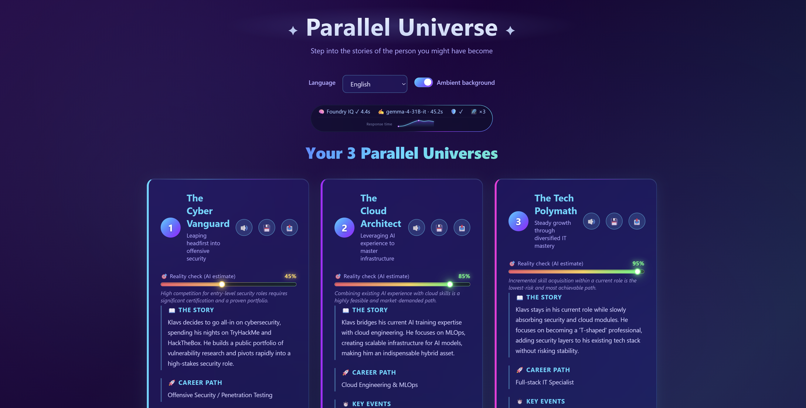
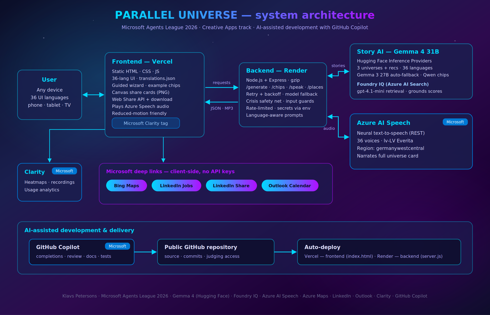
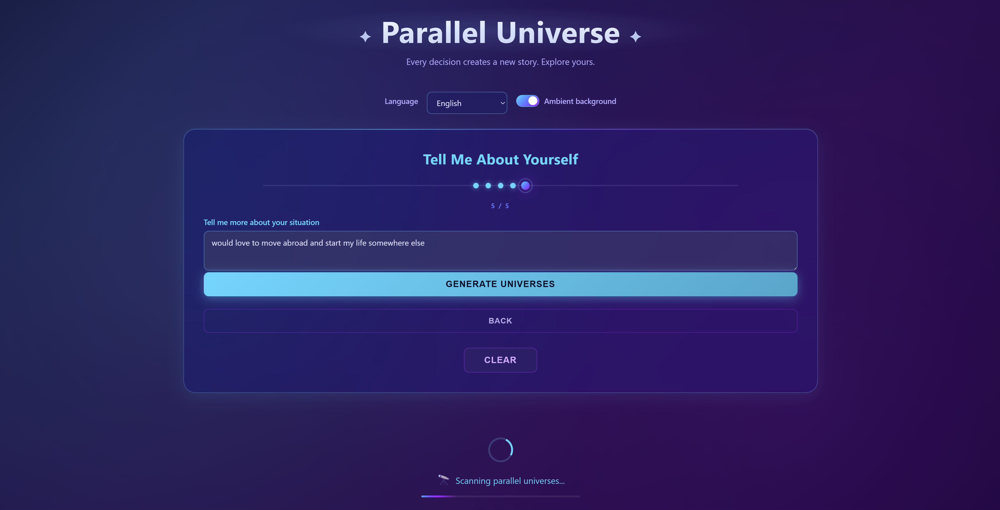
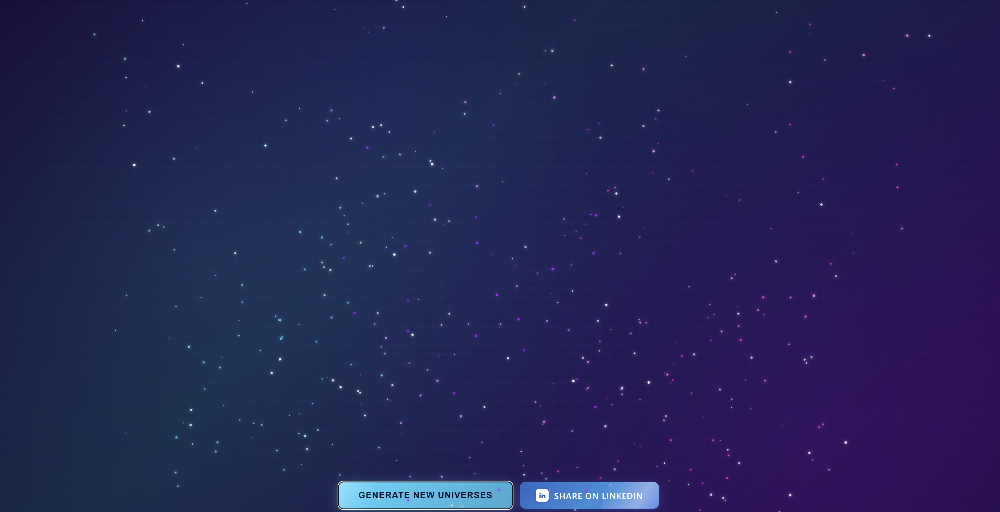

# ✨ Parallel Universe (Creative App)



**Explore the lives you didn't live.** Enter who you are, what you love, and the big decision you're facing - an AI generates three alternate-universe versions of your life (bold, balanced, cautionary), each with a story, a career path, key milestones, an outcome, and *actionable* next steps: real job roles to search on LinkedIn, travel destinations and food places pinpointed on a map, and a reality-check score - all in your native language, narrated aloud by Azure AI.

> 🏆 Built for **Microsoft Agents League Hackathon (2026) - Creative Apps track** by **Klavs Petersons**
> ✅ Integrates the required **Microsoft IQ layer: Foundry IQ** (knowledge-grounded reality scoring via Azure AI Search agentic retrieval)

**🌐 Official website:** [parallia.xyz](https://parallia.xyz)

**🚀 Live app:** [parallel-hazel.vercel.app](https://parallel-hazel.vercel.app)

**🔌 Backend API:** [health check](https://parallel-backend-wq04.onrender.com/health)

**💻 Backend repo:** [github.com/klavsy/parallel-backend](https://github.com/klavsy/parallel-backend)



---

## ✨ Features

> Three AI-imagined alternate lives, grounded in real-world data, narrated aloud, in 36 languages.

### 🧠 Core experience

| | |
|---|---|
| 🌌 **3 parallel universes** | Tailored to the user's name, interests, situation, and decision - generated by **Gemma 4 31B** via Hugging Face Inference Providers. |
| 🎯 **Reality-check score** | A 0–100 feasibility estimate per universe, **grounded by Foundry IQ** - the backend retrieves real career/labour-market facts from an Azure AI Search knowledge base (`gpt-4.1-mini` agentic retrieval) and the model calibrates each score against them. Shown as an animated, tiered gradient bar, clearly labelled as an AI estimate. |
| 🔊 **Voice narration** | Every universe read aloud with **Azure AI Speech** neural voices (36 mapped, e.g. `lv-LV-EveritaNeural`). |
| 🌍 **36 European languages** | Full UI translation *and* AI output in the selected language - including Latvian, Maltese, Welsh, Icelandic… |

### 🧭 Guided, friendly input

- **Step-by-step wizard** - a guided, one-question-at-a-time flow that greets the user and walks them through each field, instead of one long form.
- 💡 **Smart example chips** - tappable suggestions under each field. A small, fast model (`Qwen2.5-7B`) pre-generates fresh, localized examples in the background; if it's slow or unavailable, verified static chips (translated into all 36 languages) show instantly. *Pure enhancement, never a blocker.*

### 🗺️ Bring each universe to life

- 💼 **Tailored job roles** - a polished modal that opens a live **LinkedIn** (or Bing) job search for that exact role.
- 🗺️ **Embedded mini-maps (Azure Maps)** — travel spots geocoded precisely and real food places pinpointed in the right city via two-step geocoding; tap a map for address details and an "Open in Bing Maps" link.
- 📅 **Outlook Calendar** - turn any universe milestone into a real scheduled goal (deep link, no API key).
- 📤 **Shareable image cards** - 1080×1350 PNG rendered on canvas; native share sheet on mobile, direct download on desktop.

### 🎨 Crafted, polished UI

- 🌠 **Dark-star shatter** - "Generate New Universes" implodes the cards into a full-screen particle supernova before returning to the form.
- 📱 **Fully responsive** - phones → tablets → desktops → 4K; safe-area aware (iPhone notch), `prefers-reduced-motion` respected.
- 🌈 **Ambient animated background** - toggleable, preference persisted.
- 📊 **Microsoft Clarity** analytics - heatmaps and session recordings.

### 🛡️ Safe & resilient

- 💙 **Caring crisis safety net** - if input contains clear crisis language, the app (on **both client *and* server**, so it can't be bypassed) gently surfaces real support resources instead of generating. A best-effort, conservatively-tuned net - see [Security](#security).
- ♻️ **Resilient generation** - automatic retry with exponential back-off on transient rate limits, plus a transparent fallback to **Gemma 3 27B** if the primary model is busy, so a rough moment never breaks the experience.
- 🔒 **Hardened** - gibberish guard (CJK-aware), per-IP rate limiting, input sanitization, output-schema validation, XSS escaping, gzip compression, and a strict Content-Security-Policy (see [Security](#security)).






## How it works

```
user input
  → crisis safety net (surfaces support resources if crisis language detected)
  → gibberish guard (rejects keyboard-mashing before any AI call)
  → Foundry IQ retrieval (grounding facts from an Azure AI Search knowledge base)
  → story generation (Gemma 4 31B via Hugging Face)
       ↳ retry w/ back-off on rate limits · transparent fallback to Gemma 3 27B
  → output sanitizer (whitelists + length-caps every field)
  → rendered universes + a live pipeline-telemetry strip
```

## Architecture

| Layer | Tech | Hosting |
|---|---|---|
| Frontend | Static HTML/CSS/JS, canvas image export, Web Share API, i18n ×36 | Vercel |
| Backend | Node.js + Express (`/generate`, `/chips`, `/speak`, `/places`, `/map`, `/health`, diagnostics), gzip-compressed | Render |
| Microsoft IQ | **Foundry IQ** — knowledge base on Azure AI Search (`gpt-4.1-mini` for retrieval) grounds the reality-check scores | Azure |
| Story AI | **Gemma 4 31B** via Hugging Face Inference Providers (fallback: **Gemma 3 27B**) | - |
| Chips AI | **Qwen2.5-7B** via Hugging Face - small/fast model for example-chip suggestions | - |
| Voice AI | Azure AI Speech neural TTS (region `germanywestcentral`) | Azure |
| Maps | Azure Maps (precise geocoding + static mini-map proxy) | Azure |
| Integrations | LinkedIn, Bing Maps, Outlook Calendar (client-side deep links) | - |
| Analytics | Microsoft Clarity | - |

See `architecture.png` / `architecture.svg` for the full diagram. The backend lives in a separate repository - see the link above.

## Internationalization (modular)

English UI strings ship inline in `index.html` so the interface renders instantly and works even if anything else fails; the other 35 languages live in **`translations.json`**, loaded on demand and merged at runtime. This keeps the HTML lean while staying resilient - a failed or slow fetch simply means an English-only UI, never broken text.

## Frontend

This repo is the frontend: a single `index.html` (HTML + CSS + JavaScript, no build step) deployed as a static site on Vercel. It calls the backend API for generation, narration, and maps. To point it at a different backend, edit `API_BASE` near the top of the `<script>` in `index.html`.

## Microsoft IQ - Foundry IQ

This project integrates **Foundry IQ**, the required Microsoft IQ layer. Before generating, the backend performs **agentic retrieval** against a knowledge base hosted on **Azure AI Search** (using `gpt-4.1-mini` for the retrieval/reasoning step). The knowledge base contains career-change, retraining, relocation, and labour-market reference material, and the retrieved facts are injected into the generation prompt so each universe's reality-check score is grounded in real-world base rates rather than guesswork. Retrieval has an 8-second timeout and full graceful degradation — if it is unavailable, generation still completes with ungrounded estimates and the app never hangs. The retrieval implementation lives in the [backend repository](https://github.com/klavsy/parallel-backend).

## Deploy

- **Frontend (Vercel):** deploy `index.html` as a static site - no build step.
- **Backend (Render):** see the backend repository for setup and the full environment-variable list.

## Security

- All AI output is **schema-whitelisted and length-capped server-side** and **HTML-escaped client-side** (XSS defence in depth).
- User input is type-checked, trimmed, capped, and stripped of angle brackets; prompts wrap it in delimited data blocks with explicit anti-injection instructions, and the response is re-validated against a strict schema.
- **Gibberish guard** — language-agnostic detection (Unicode-aware, safe across all 36 languages) blocks keyboard-mash input both client-side and server-side before any AI tokens are spent.
- Per-IP **rate limiting** on every functional route; 50 KB JSON body cap.
- **CORS** configurable via `ALLOWED_ORIGINS` (lock to the frontend origin, or leave open for multi-URL demo access); security headers (`nosniff`, `X-Frame-Options: DENY`, referrer policy); strict **Content-Security-Policy** on the frontend.
- All API keys live server-side only - map images are proxied so the Azure Maps key never reaches the browser.

## Project notes & honest limitations

A few deliberate, transparent design choices worth noting:

- **Analytics - Microsoft Clarity** is embedded in `index.html` as a client-side script (its standard, documented installation). The Clarity project ID is visible in the page source by design - like a Google Analytics ID, it is not a secret and exposes no private data. It is intentionally *not* on the backend, because Clarity tracks real in-browser behaviour and can only do so from the browser.
- **Maps - Azure Maps** powers the precise city/restaurant pinpointing and the embedded mini-maps. The "Open in Bing Maps" buttons simply deep-link to the public Bing Maps website (no Bing API is used).
- **Job postings** open *live LinkedIn searches* for each role rather than one specific posting — LinkedIn's Jobs API is partner-only and scraping would violate their terms, so live search is the compliant, honest approach.
- **Menu/pricing info** links out to a live web search rather than being shown in-app; no free API provides reliable real-time pricing, so the app avoids displaying numbers that could be inaccurate.
- **Reality-check scores** are AI estimates, *grounded by Foundry IQ* against a real knowledge base, and are clearly labelled as estimates - never presented as guarantees.

## Development

### AI-assisted development

This project was built primarily through AI-assisted development, in the spirit of the Agents League. **The majority of the code was written by AI tools under the author's direction.** For full transparency:

- **GitHub Copilot** (Free tier) - in-editor code completions (usage limited by the free-plan monthly cap).
- **Claude** (Anthropic) - architecture, feature implementation, debugging, multilingual content, and documentation, via an AI pair-programming workflow.

### Human development & engineering (by the author)

While AI generated most of the code, the project was conceived, architected, configured, deployed, and operated by the author:

- **Concept, product design & UX** - the idea, the three-universe model, the reality-check scoring, the feature set, and the step-by-step interface.
- **Microsoft Azure infrastructure** - provisioning and configuring Azure AI Foundry, **Foundry IQ** on Azure AI Search (knowledge base creation, document ingestion, retrieval wiring), Azure AI Speech, and Azure Maps.
- **Deployment & operations** - Vercel (frontend) and Render (backend), environment configuration, CORS, and cross-service testing.
- **Hands-on code changes** - the author also directly edited and tweaked parts of the AI-generated code where needed.
- **Development environment** - **Visual Studio Code** with the GitHub Copilot extension.
- **Direction & review** - the author specified what to build, made all architectural and security decisions, and tested and reviewed the AI-generated code before shipping.

### 🚧 Prototype Status!

This application was developed as a hackathon prototype and serves as a proof of concept for exploring alternate life paths through AI. The current implementation focuses on demonstrating the vision and key functionality. Future versions may feature a more modular architecture, richer simulations, expanded integrations, enhanced personalization, stronger safety features, and a more refined user experience.


