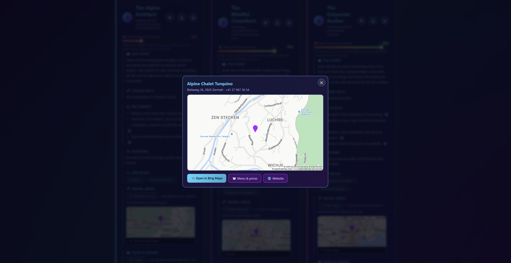

# ✨ Parallel Universe (Creative App)


What if you could see where your choices might lead?

Enter your personality, passions, and the decision that's keeping you up at night. AI generates three alternate futures - ambitious, balanced, and cautionary - each revealing a different version of your life.

Follow unique storylines, explore potential careers, discover key milestones, and uncover outcomes shaped by your decisions. Get actionable recommendations, from real-world job roles to search for, to travel destinations and local food spots tailored to each path. Every future includes a reality score to help separate fantasy from possibility.

Available in your native language and narrated with lifelike Azure AI voices, your alternate lives are just one decision away.


> 🏆 Built for **Microsoft Agents League Hackathon (2026) - Creative Apps track** by **Klavs Petersons**
> ✅ Integrates the required **Microsoft IQ layer: Foundry IQ** (knowledge-grounded reality scoring via Azure AI Search agentic retrieval)

** Official website:** [parallia.xyz](https://parallia.xyz)

** Live app:** [parallel-hazel.vercel.app](https://parallel-hazel.vercel.app)

** Backend API:** [health check](https://parallel-backend-wq04.onrender.com/health)

** Backend repo:** [github.com/klavsy/parallel-backend](https://github.com/klavsy/parallel-backend)


---

## ✨ Features

### 🌌 AI-Powered Universe Generation
- **3 AI-generated parallel universes** tailored to the user's name, interests, situation, and decision.
- Powered by **Gemma 4 31B**, with **Gemma 3 27B** automatically serving as a fallback model via Hugging Face Inference Providers.
- **Smart AI chips (Qwen)** that generate contextual, pill-shaped answer suggestions beside form fields to speed up user input and reduce typing.

### 🧭 Guided Experience
- **Step-by-step wizard** that greets users and guides them through one question at a time instead of a long form.

### 🎯 Reality-Grounded Insights
- **Foundry IQ Reality-check score (0–100)** for every universe, calibrated against real labour-market and career data retrieved from an Azure AI Search knowledge base using agentic retrieval and GPT-4.1 Mini.
- Scores are displayed as animated gradient bars and clearly labelled as AI-generated estimates.
- 💼 **Tailored job recommendations** with one-click LinkedIn or Bing job searches for each generated role.

### 🗺️ Exploration & Planning
- **Azure Maps integration** with precisely geocoded destinations and real food locations.
- Interactive map modals with addresses and direct Bing Maps links.
- 📅 **Outlook Calendar integration** for turning universe milestones into real scheduled goals.

### 🔊 Immersive Storytelling
- **Voice narration for every universe** using Azure AI Speech neural voices.
- Support for **36 localized voices**, including region-specific voice mappings.
- 🌠 **Dark-Star Shatter animation** that transforms regeneration into a full-screen particle supernova experience.

### 📤 Sharing & Social
- **Shareable image cards** rendered as high-quality 1080×1350 PNGs.
- Native mobile share sheet support and direct desktop downloads.
- 🔗 **Rich Open Graph previews** for social media and messaging platforms.

### 🌍 Localization
- **36 European languages** with complete UI localization and AI responses in the selected language.
- Includes support for languages such as Latvian, Maltese, Welsh, Icelandic, and many more.
- 🌐 **Modular JSON translation architecture** for scalability and maintainability.

### 🎨 User Experience
- **Fully responsive design** optimized for phones, tablets, desktops, and 4K displays.
- Safe-area aware (including iPhone notch support).
- Respects `prefers-reduced-motion` accessibility settings.
- **Toggleable animated ambient background** with persisted user preferences.

### ⚡ Performance
- 📦 **Gzip compression** for reduced payload sizes and faster delivery.
- 🔄 **Automatic model fallback** to maintain reliability and uninterrupted generation.

### 📊 Analytics
- **Microsoft Clarity integration** with heatmaps and session recordings for product insights.

### 🛡️ Safety & Security
- **Self-harm and crisis safeguards** across both frontend and backend, including supportive intervention flows and access to relevant help resources.
- **Security hardening** with rate limiting, gibberish detection, input sanitization, schema validation, XSS protection, output validation, and a strict Content Security Policy (CSP).




## How it works

```
user input
  → gibberish guard (rejects keyboard-mashing before any AI call)
  → Foundry IQ retrieval (grounding facts from an Azure AI Search knowledge base)
  → story generation (Gemma 4 31B via Hugging Face)
  → output sanitizer (whitelists + length-caps every field)
  → rendered universes + a live pipeline-telemetry strip
```

## Architecture

| Layer | Tech | Hosting |
|---|---|---|
| Frontend | Static HTML/CSS/JS, canvas image export, Web Share API, i18n ×36 | Vercel |
| Backend | Node.js + Express (`/generate`, `/speak`, `/places`, `/map`, `/health`, diagnostics) | Render |
| Microsoft IQ | **Foundry IQ** - knowledge base on Azure AI Search (`gpt-4.1-mini` for retrieval) grounds the reality-check scores | Azure |
| Story AI | **Gemma 4 31B** via Hugging Face Inference Providers | - |
| Voice AI | Azure AI Speech neural TTS (region `germanywestcentral`) | Azure |
| Maps | Azure Maps (precise geocoding + static mini-map proxy) | Azure |
| Integrations | LinkedIn, Bing Maps, Outlook Calendar (client-side deep links) | - |
| Analytics | Microsoft Clarity | - |

See `architecture.png` / `architecture.svg` for the full diagram. The backend lives in a separate repository - see the link above.

## Frontend

This repo is the frontend: a single `index.html` (HTML + CSS + JavaScript, no build step) deployed as a static site on Vercel. It calls the backend API for generation, narration, and maps. To point it at a different backend, edit `API_BASE` near the top of the `<script>` in `index.html`.

## Microsoft IQ - Foundry IQ

This project integrates **Foundry IQ**, the required Microsoft IQ layer. Before generating, the backend performs **agentic retrieval** against a knowledge base hosted on **Azure AI Search** (using `gpt-4.1-mini` for the retrieval/reasoning step). 

The knowledge base contains career-change, retraining, relocation, and labour-market reference material, and the retrieved facts are injected into the generation prompt so each universe's reality-check score is grounded in real-world base rates rather than guesswork. 

Retrieval has an 8-second timeout and full graceful degradation — if it is unavailable, generation still completes with ungrounded estimates and the app never hangs. The retrieval implementation lives in the [backend repository](https://github.com/klavsy/parallel-backend).

## Deploy

- **Frontend (Vercel):** deploy `index.html` as a static site - no build step.
- **Backend (Render):** see the backend repository for setup and the full environment-variable list.

## Security

- All AI output is **schema-whitelisted and length-capped server-side** and **HTML-escaped client-side** (XSS defence in depth).
- User input is type-checked, trimmed, capped, and stripped of angle brackets; prompts wrap it in delimited data blocks with explicit anti-injection instructions, and the response is re-validated against a strict schema.
- **Gibberish guard** - language-agnostic detection (Unicode-aware, safe across all 36 languages) blocks keyboard-mash input both client-side and server-side before any AI tokens are spent.
- Per-IP **rate limiting** on every functional route; 50 KB JSON body cap.
- **CORS** configurable via `ALLOWED_ORIGINS` (lock to the frontend origin, or leave open for multi-URL demo access); security headers (`nosniff`, `X-Frame-Options: DENY`, referrer policy); strict **Content-Security-Policy** on the frontend.
- All API keys live server-side only - map images are proxied so the Azure Maps key never reaches the browser.

## Project notes & honest limitations

A few deliberate, transparent design choices worth noting:

- **Analytics - Microsoft Clarity** is embedded in `index.html` as a client-side script (its standard, documented installation). The Clarity project ID is visible in the page source by design - like a Google Analytics ID, it is not a secret and exposes no private data. It is intentionally *not* on the backend, because Clarity tracks real in-browser behaviour and can only do so from the browser.
- **Maps - Azure Maps** powers the precise city/restaurant pinpointing and the embedded mini-maps. The "Open in Bing Maps" buttons simply deep-link to the public Bing Maps website (no Bing API is used).
- **Job postings** open *live LinkedIn searches* for each role rather than one specific posting - LinkedIn's Jobs API is partner-only and scraping would violate their terms, so live search is the compliant, honest approach.
- **Menu/pricing info** links out to a live web search rather than being shown in-app; no free API provides reliable real-time pricing, so the app avoids displaying numbers that could be inaccurate.
- **Reality-check scores** are AI estimates, *grounded by Foundry IQ* against a real knowledge base, and are clearly labelled as estimates - never presented as guarantees.

## Development

### AI-assisted development

This project was built primarily through AI-assisted development, in the spirit of the Agents League. **The majority of the code was written by AI tools under the author's direction.** For full transparency:

- **GitHub Copilot** (Free tier) - in-editor code completions (usage limited by the free-plan monthly cap).
- **Claude** (Anthropic) - architecture, feature implementation, debugging, multilingual content, and documentation, via an AI pair-programming workflow.

### Human development & engineering (by the author)

While AI generated most of the code, the project was conceived, architected, configured, deployed, and operated by the author:

- **Concept, product design & UX** - the idea, the three-universe model, the reality-check scoring, the feature set, and the step-by-step interface.
- **Microsoft Azure infrastructure** - provisioning and configuring Azure AI Foundry, **Foundry IQ** on Azure AI Search (knowledge base creation, document ingestion, retrieval wiring), Azure AI Speech, and Azure Maps.
- **Deployment & operations** - Vercel (frontend) and Render (backend), environment configuration, CORS, and cross-service testing.
- **Hands-on code changes** - the author also directly edited and tweaked parts of the AI-generated code where needed.
- **Development environment** - **Visual Studio Code** with the GitHub Copilot extension.
- **Direction & review** - the author specified what to build, made all architectural and security decisions, and tested and reviewed the AI-generated code before shipping.

### 🚧 Prototype Status!

This application was developed as a hackathon prototype and serves as a proof of concept for exploring alternate life paths through AI. The current implementation focuses on demonstrating the vision and key functionality. Future versions may feature a more modular architecture, richer simulations, expanded integrations, enhanced personalization, stronger safety features, and a more refined user experience.
